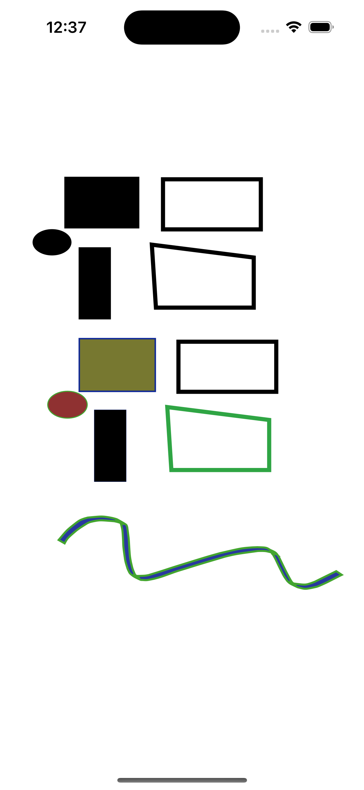

# svg2canvas
Convert your svg to code

## Install

```bash
pip install .
```

## Example Python Tkinter

Source svg:


```bash
svg2canvas -i Examples/pic.svg -o output
```

will produce output.py:
```python
import tkinter

top = tkinter.Tk()
canvas = tkinter.Canvas(top, bg="white", height=1122.5202912, width=793.7012159999999)
canvas.create_rectangle(92.3991503679552, 70.7260766172576, 253.37922217903682, 181.2595838643744, width=0.9999992801568001, fill="#000000", outline="")
canvas.create_rectangle(123.2664816819744, 222.8492365589952, 191.9660765750112, 377.4527657141472, width=0.9999992801568001, fill="#000000", outline="")
canvas.create_oval(23.837217281539203, 183.74560007296418, 106.85717770284481, 239.48013776014943, width=0.9999992801568001, fill="#000000", outline="")
canvas.create_rectangle(304.9625256245568, 75.7485461010432, 516.1806529106304, 183.77092632286082, width=8.938587504000001, fill="", outline="#000000")
...
draw_cubic_bezier(canvas, (106.150375431,825.624748199), (79.6345374908,853.699358635), (96.2843253793,833.919417245), (96.2843253793,833.919417245), 4.403151984, "#43a52f")
draw_cubic_bezier(canvas, (79.6345374908,853.699358635), (92.5597047854,861.070272852), (79.6345374908,853.699358635), (79.6345374908,853.699358635), 4.403151984, "#43a52f")
canvas.create_line(92.55970478536297, 861.0702728517123, 92.5597047853632, 861.070272851712, width=4.403151984, fill="#43a52f")
canvas.pack()
top.mainloop()

```

Result:


## Example Python Swift UIKit

Using next command you can generate code for Swift UIKit:
```bash
./svg2canvas.py -i Examples/pic.svg -t swift-uikit  -o swift_canvas
```

will produce swift_canvas.swift:

```swift
import UIKit
class GeneratedCanvasView: UIView {
    override func draw(_ rect: CGRect) {
        let path3 = UIBezierPath(rect: CGRect(x:92.3991503679552, y:70.7260766172576, width: 160.98007181108161, height: 110.5335072471168))
        path3.lineWidth = 0.9999992801568001
        UIColor(hex: 0x000000).setFill()
        path3.stroke()
        path3.fill()
        let path4 = UIBezierPath(rect: CGRect(x:123.2664816819744, y:222.8492365589952, width: 68.6995948930368, height: 154.60352915515202))
        path4.lineWidth = 0.9999992801568001
        UIColor(hex: 0x000000).setFill()
        path4.stroke()
        path4.fill()
        let path5 = UIBezierPath(ovalIn: CGRect(x:23.837217281539203, y:183.74560007296418, width: 83.01996042130561, height: 55.73453768718528))
        path5.lineWidth = 0.9999992801568001
        UIColor(hex: 0x000000).setFill()
        path5.stroke()
        path5.fill()
        let path6 = UIBezierPath(rect: CGRect(x:304.9625256245568, y:75.7485461010432, width: 211.2181272860736, height: 108.0223802218176))
        path6.lineWidth = 8.938587504000001
        UIColor(hex: 0x000000).setStroke()
        path6.stroke()
        ...
    }
}
```

Result (was used transformation to scale the result):

