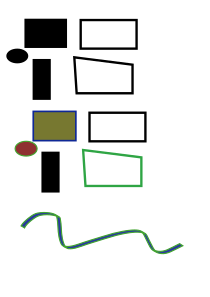
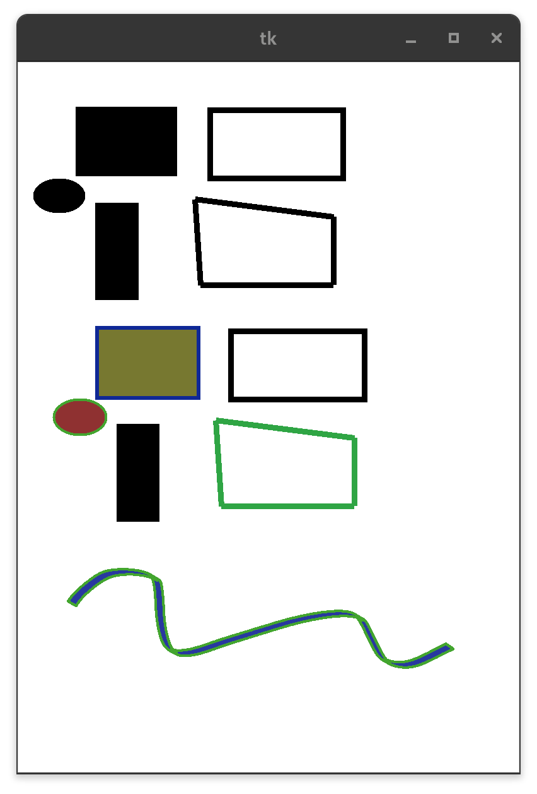

# svg2canvas
Convert your svg to code

## Example

Source svg:


```bash
svg2canvas -i pic.svg -o output
```

will produce output.py:
```python
import tkinter
top = tkinter.Tk()
canvas = tkinter.Canvas(top, bg="white", height=1122.5202912, width=793.7012159999999)
canvas.create_rectangle(92.3991503679552, 70.7260766172576, 253.37922217903682, 181.2595838643744, width=0.9999992801568001, fill="#000000", outline="")
canvas.create_rectangle(123.2664816819744, 222.8492365589952, 191.9660765750112, 377.4527657141472, width=0.9999992801568001, fill="#000000", outline="")
canvas.create_oval(23.837217281539203, 183.74560007296418, 106.85717770284481, 239.48013776014943, width=0.9999992801568001, fill="#000000", outline="")
canvas.create_rectangle(304.9625256245568, 75.7485461010432, 516.1806529106304, 183.77092632286082, width=8.938587504000001, fill="", outline="#000000")
canvas.create_line(280.8632962330272, 216.76991233128, 500.902078360992, 244.5044671504512, width=8.938587504000001, fill="#000000")
canvas.create_line(500.902078360992, 244.5044671504512, 500.902078360992, 352.5268473722688, width=8.938587504000001, fill="#000000")
canvas.create_line(500.902078360992, 352.5268473722688, 289.6839359568, 352.5268473722688, width=8.938587504000001, fill="#000000")
canvas.create_line(289.6839359568, 352.5268473722688, 280.8632962330272, 216.76991233128, width=8.938587504000001, fill="#000000")
canvas.create_rectangle(125.7595727920224, 421.036158068064, 286.739644603104, 531.5696653151808, width=6.292916784, fill="#777830", outline="#0f2896")
canvas.create_rectangle(156.62690032651201, 573.159314230272, 225.3264952195488, 727.762843385424, width=0.9999992801568001, fill="#000000", outline="")
canvas.create_oval(57.197647264665584, 534.0556928623593, 140.2176076859712, 589.7902305495446, width=4.403151984, fill="#8f3131", outline="#43a52f")
canvas.create_rectangle(338.322948048624, 426.058585977024, 549.5410753346977, 534.0809661988416, width=8.938587504000001, fill="", outline="#000000")
canvas.create_line(314.22371865709437, 567.079978663968, 534.262512123648, 594.814544821728, width=8.938587504000001, fill="#2fa544")
canvas.create_line(534.262512123648, 594.814544821728, 534.262512123648, 702.836940161664, width=8.938587504000001, fill="#2fa544")
canvas.create_line(534.262512123648, 702.836940161664, 323.0443583808672, 702.836940161664, width=8.938587504000001, fill="#2fa544")
canvas.create_line(323.0443583808672, 702.836940161664, 314.22371865709437, 567.079978663968, width=8.938587504000001, fill="#2fa544")
canvas.pack()
top.mainloop()
```

Result:


